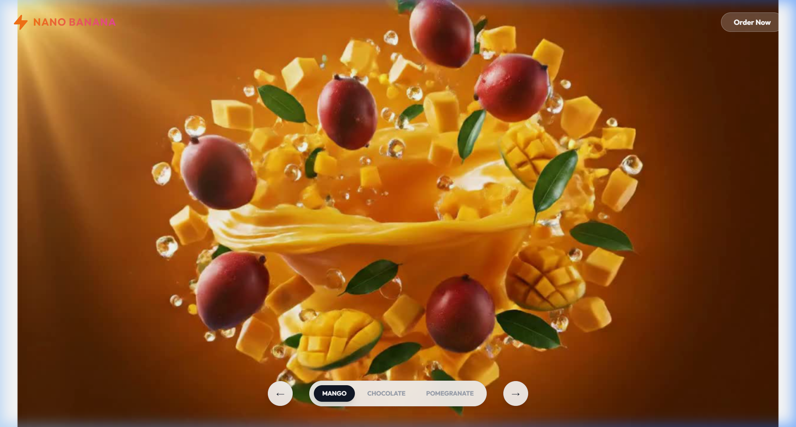
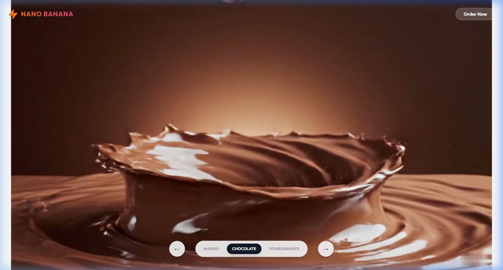
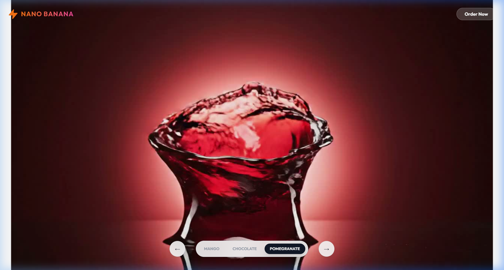

# Nano Banana — Premium Cold-Pressed Juice Showcase

A visually stunning, Apple-inspired product showcase website for **Nano Banana**, a premium cold-pressed juice brand. Built with **Next.js 14**, featuring scroll-driven bottle animations, smooth flavor transitions, and a modern glassmorphism UI.


---

## Demo Video

Check out the full website walkthrough here:

[**Watch the Demo Video**](https://drive.google.com/file/d/1V-nF6MFc5H58Jri1Rzf3SBddlFesPdRf/view?usp=sharing)

---

## Screenshots

### Cream Mango


### Dutch Chocolate


### Ruby Pomegranate


---

## Features

- **Scrollytelling Bottle Animation** — Frame-by-frame bottle rotation synced to scroll position (Apple-style), rendered on HTML Canvas for high performance
- **Multi-Flavor Navigation** — Seamlessly switch between 3 juice flavors with smooth gradient background transitions
- **Framer Motion Animations** — Page transitions with `AnimatePresence`, scroll-triggered reveal animations, and hover effects
- **Glassmorphism UI** — Frosted-glass navbar and floating pill navigation with backdrop blur effects
- **Responsive Design** — Fully responsive layout optimized for desktop and mobile
- **Static Export Ready** — Configured for static site generation with `output: 'export'`

---

## Products

| Flavor | Price | Key Highlights |
|---|---|---|
| **Cream Mango** | Rs.120 / 300ml | Alphonso mangoes, 100% pulp, cold-pressed, HPP treated |
| **Dutch Chocolate** | Rs.140 / 300ml | Plant-based, almond milk, dairy-free, 12g protein |
| **Ruby Pomegranate** | Rs.150 / 300ml | Heart-healthy, antioxidant-rich, vitamins A/C/K |

---

## Tech Stack

| Technology | Purpose |
|---|---|
| [Next.js 14](https://nextjs.org/) | React framework with App Router |
| [TypeScript](https://www.typescriptlang.org/) | Type-safe development |
| [Tailwind CSS 3](https://tailwindcss.com/) | Utility-first styling |
| [Framer Motion](https://www.framer.com/motion/) | Animations & page transitions |
| HTML Canvas API | Frame-by-frame bottle scroll animation |

---

## Project Structure

```
nano-banana/
├── app/
│   ├── layout.tsx             # Root layout with metadata
│   ├── page.tsx               # Main page — orchestrates all sections
│   ├── globals.css            # Global styles
│   └── favicon.ico
├── components/
│   ├── Navbar.tsx             # Fixed navbar with scroll-aware styling
│   ├── ProductBottleScroll.tsx # Scroll-driven bottle canvas animation
│   ├── ProductTextOverlays.tsx # Animated text overlays synced to scroll
│   ├── ProductDetails.tsx     # Product info, stats, and freshness section
│   ├── BuyNow.tsx             # Purchase CTA with pricing & policies
│   ├── NextFlavor.tsx         # "Next Flavor" teaser card
│   └── Footer.tsx             # Footer with links & newsletter signup
├── data/
│   ├── products.ts            # Product data (flavors, pricing, copy)
│   └── basePath.ts            # Dynamic base path for dev/prod
├── public/
│   └── images/
│       ├── mango/             # 145 frame sequence (1.jpg - 145.jpg)
│       ├── chocolate/         # 113 frame sequence (1.jpg - 113.jpg)
│       └── pomegranate/       # 97 frame sequence (1.jpg - 97.jpg)
├── next.config.js             # Next.js config (static export, base path)
├── tailwind.config.js         # Tailwind configuration
├── tsconfig.json              # TypeScript configuration
└── package.json
```

---

## Getting Started

### Prerequisites

- **Node.js** 18.x or higher
- **npm** (comes with Node.js)

### Installation

1. **Clone the repository**
   ```bash
   git clone <repository-url>
   cd nano-banana
   ```

2. **Install dependencies**
   ```bash
   npm install
   ```

3. **Run the development server**
   ```bash
   npm run dev
   ```

4. **Open in browser**
   Navigate to [http://localhost:3000](http://localhost:3000)

### Build for Production

```bash
npm run build
```

The static site will be generated in the `out/` directory.

---

## Available Scripts

| Command | Description |
|---|---|
| `npm run dev` | Start development server on `localhost:3000` |
| `npm run build` | Build for production (static export to `out/`) |
| `npm run start` | Start production server |
| `npm run lint` | Run ESLint for code quality checks |

---

## How It Works

### Scroll Animation (Scrollytelling)

The hero section uses a **frame-by-frame animation** technique:

1. A sequence of pre-rendered bottle images (e.g., 145 frames for mango) is stored in `public/images/<flavor>/`
2. `ProductBottleScroll.tsx` preloads all frames into memory
3. As the user scrolls, `useScroll` from Framer Motion maps the scroll position to a frame index
4. The corresponding frame is drawn to an HTML `<canvas>` element at 60fps using `requestAnimationFrame`
5. The result is a smooth, Apple-style 3D bottle rotation driven entirely by scroll

### Flavor Switching

- A **pill navigation bar** at the bottom allows users to switch between flavors
- `AnimatePresence` handles smooth fade transitions between products
- The global background gradient transitions using CSS `transition-all` to avoid white flashes during unmount

---

## Adding Frame Sequences

To add a new juice flavor:

1. Create a folder in `public/images/<flavor-id>/`
2. Add numbered frame images (e.g., `1.jpg`, `2.jpg`, ... `N.jpg`)
3. Optionally add a `hero.png` for the product details section
4. Add a new entry in `data/products.ts` with the product data and `frameCount`

---

## License

Copyright 2026 Nano Banana Inc. All rights reserved.
